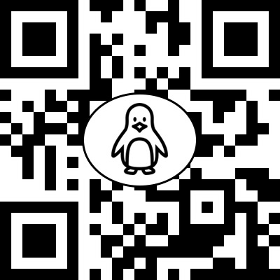

# Penguin Pet - AR Project
Learning Project for the "Virtual and Augmented Reality" course in the "Master in Innovation and Research in Informatics (MIRI): Specialization in Computer Graphics and Virtual Reality", at Universitat Politècnica de Catalunya (UPC).

## Description
Basic penguin pet simulator. The user's goal is to avoid an having insufficient level on any of the penguin's needs. There are 3 needs:
- Hunger
- Hygiene
- Happiness
  
(Video demo available soon)

## Environment Registration
The registration of the environment is done via markers (stored in a custom Vuforia database). For this application, three diferent markers have been designed:

        

- **Penguin marker**: Spawns the penguin pet on it.  
- **Fish marker**: Spawns a bunch of fishes. Those use gravity to be physically coherent, therefore rotating
the marker too much can make the spawned fishes to fall.  
- **Seal marker**: Spawns a seal on it.  

The world reference system is defined by the device.

## Available interactions
Before being able to perform any activity, the user must confirm that he/she is ready, so that the penguin levels
can be initialized. To perform this confirmation, the user has to **tap on the penguin**. Then, status bars will
appear above it, and will start to decrease over time.  
Once the penguin has been initialized, other activities may and should be performed to avoid loosing the game:
- **Feed the penguin**: To feed the penguin, the user must have the **penguin and fish markers** close enough
(but not too much), and once **both objects** are **visible**, **grab a fish** and bring it to the penguin's
mouth (using **finger pan**).  
Grabbed fishes can be dropped anywhere by ending the touch, and grabbed again using the same procedure stated above.  
  
- **Wash the penguin**: To wash the penguin, there is no need for any marker but the penguin's one. Once the **penguin is in view**, a sponge blue button will appear on the bottom part of the screen. Once this **button is pressed**, the user can **tap and pan around the penguin**, and a sponge will appear following his/her finger symbolising the washing.  
The hygiene bar will increase at the same rate independently of the penguin's region being washed.  
  
- **Entertain the penguin**: To make the penguin happy, the user must use both the **penguin and seal markers**. If **both** spawned objects are **in view** and they are **close enough**, the seal will go to the penguin's position and greet him. While this scenario is active, the penguin gains happiness. To avoid performance errors, it is recommended to move the markers always in a visible region by the camera once the interaction has been triggered.  

As a complementary interaction, once the penguin has been initialized the user can tap on the same penguin
or the seal, and those will trigger an animation and sound (like a greeting).

## Sources
### 3D Models and Animations
Penguin: [Mateus Schwaab (Sketchfab)](https://skfb.ly/6DLnG)  
Seal: [DanielWichterich (Sketchfab)](https://skfb.ly/6RzPp)  
Fish: [salmonclosebeta (Sketchfab)](https://skfb.ly/6UXuA)  

### Sounds
Penguin: [MATRIXXX_ (Freesound)](https://freesound.org/people/MATRIXXX_/sounds/459341/)  
Seal: [MATRIXXX_ (Freesound)](https://freesound.org/people/MATRIXXX_/sounds/459156/)  
Eat SFX: [InspectorJ (Freesound)](https://freesound.org/people/InspectorJ/sounds/412068/)  
Wash SFX: [DJames619 (Freesound)](https://freesound.org/people/DJames619/sounds/389270/)
 
